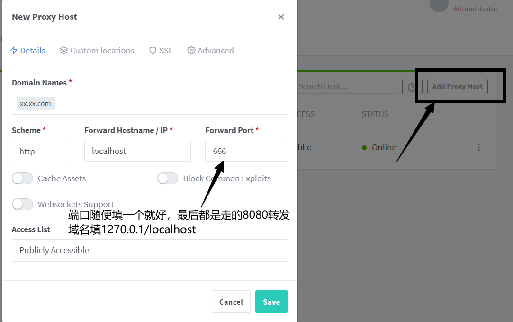
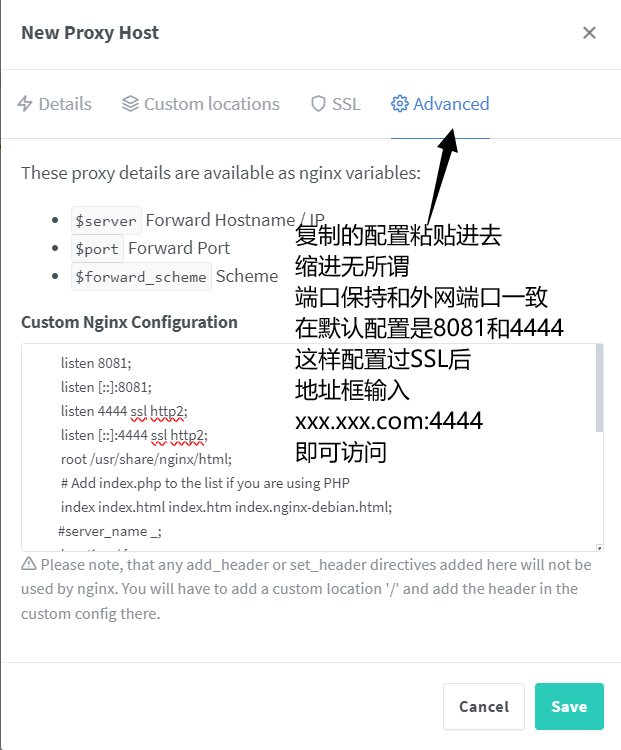
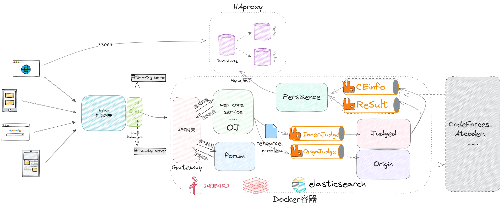
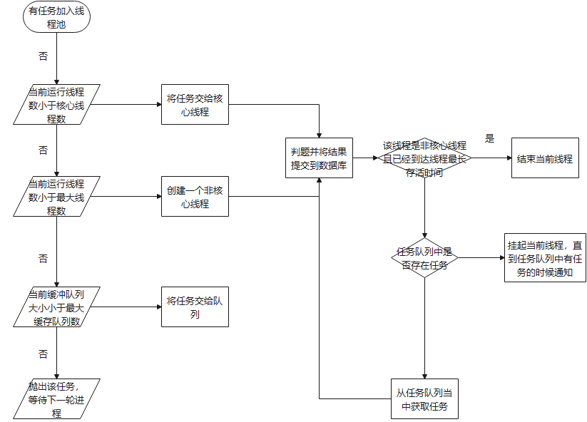
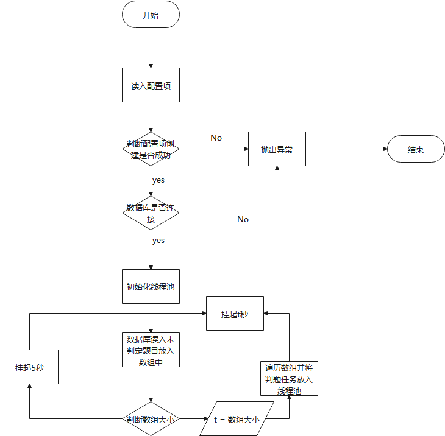

# AHUT在线判题系统

## 前言

本项目是AHUT在线判题系统的后端部分，前端部分请查看[前端部分](https://github.com/ximoyuxiao/ahutoj-view)

项目主要用于AHUT ACM训练队的训练和比赛，目前仍在开发中。  
另，包含了监控和日志系统，可以根据需求进行修改。

在线预览：http://101.42.232.70/

## 项目简介

### 环境:

Linux,Mac,或安装有linux虚拟机的Windows

### 部署

第一次部署：<p>
1、运行

```shell  
sudo bash -x first.sh  
```  

2、删除 config.yaml.bak 文件.bak后缀，根据自己情况修改对应配置

3、运行localhost:8181访问nginx-proxy-manager，添加域名，配置ssl证书,和代理配置

默认账号: admin@example.com
默认密码: changeme

添加SSL证书



添加反向代理配置



默认配置:

```
listen 8081;
listen [::]:8081;
listen 4444 ssl http2;
listen [::]:4444 ssl http2;
root /usr/share/nginx/html;
# Add index.php to the list if you are using PHP
index index.html index.htm index.nginx-debian.html;
#server_name _;
location / {
        # First attempt to serve request as file, then
        # as directory, then fall back to displaying a 404.
        error_page 404 /index.html;
}
location /api{
        proxy_pass http://gateway:4433;
}
location /image{
        root /resource;
}
```

4、运行localhost:5601访问kibana，配置logstash索引
默认账号:elastic

默认密码:123456(初始密码大部分都是这个)
5、环境变量配置
新建.env文件(跟远程备份有关)

```
REMOTE_BACKUP_SERVER= 
REMOTE_BACKUP_PATH= 
REMOTE_BACKUP_USER= 
REMOTE_BACKUP_PASSWORD= 
```

### 注意事项

项目核心配置文件:

- config/config.yaml
- docker-compose.yaml
  如果需要添加服务/负载均衡请在 config.yaml 下添加，并修改 web/utils/config.go 下对应结构体

常用命令:

```
sudo docker-compose up -d 启动项目
sudo docker rmi $(sudo docker images --filter "dangling=true" -q) 删除构建镜像，减小无用镜像占用
sudo docker ps|grep <container name>|awk '{print $1}'|sudo docker rm/rmi
删除对应的容器及其镜像
```

### 相关依赖:

C/C++: rabbitMQ\libamqp-dev,hiredis,libmysql

Go: gorm、gin

### 技术选型

- 前端：用基于 Vue+Vite 构建基础页面。
- 后端：用 Gin 快速搭建基础restful风格API，Gin 是一个go语言编写的Web框架。
- 数据库：采用Mysql:8.0.28使用 gorm 实现对数据库的基本操作,使用 mysqldump+cron 实现远程备份。
- 缓存：使用Redis实现记录当前活跃用户的jwt令牌并实现多点登录限制。
- 消息队列：使用RabbitMQ实现消息队列。
- 配置文件：viper 实现yaml格式的配置文件。
- 日志：使用 logrus 实现日志记录，使用 ELK 实现日志的收集和分析。

### 项目结构图

.  
├── README.md  
├── first.sh 项目第一次部署脚本  
├── debug.sh 项目调试脚本  
├── core.dockerfile 构建C++本地服务 oj-judged docker镜像  
├── dev.dockerfile 构建Go本地服务 docker镜像  
├── docker-compose 构建多容器运行环境  
├── config 配置文件(mysql,filebeat,nginx,及项目配置)  
├── core 内部判题程序  
├── docs 各种文档资源  
├── resource 静态资源层,docker持久化卷  
│ ├── Data 判题数据.in .out  
│ ├── spj 特判  
│ └── mysql mysql数据  
│ └──elastic elastic数据  
│ └──rabbitmq rabbitmq数据  
│ └── ...  
├── logs docker容器的日志  
└── web 后端web  
├── cache 缓存  
├── controller 控制层  
├── dao DAO数据库层  
├── io 请求与相应  
├── logic 逻辑层  
├── mapping 模型映射层  
├── middlewares 中间件  
├── models 模型层  
├── routers 路由模块  
├── service 各种服务  
└── utils 各种工具类

### 项目分层

- 网关层/路由层

> 作为微服务的入口，负责请求的转发

- 控制层

> 负责接收请求，解析参数，调用逻辑层

- 服务层

> 部分复杂业务逻辑的处理

- 逻辑层

> 负责业务逻辑的处理

- 模型层

> 数据模型的定义

- 数据库层

> 数据库的操作

### 系统架构图


最新版本移除persistence服务，合并在OJ服务中

### 判题流程





