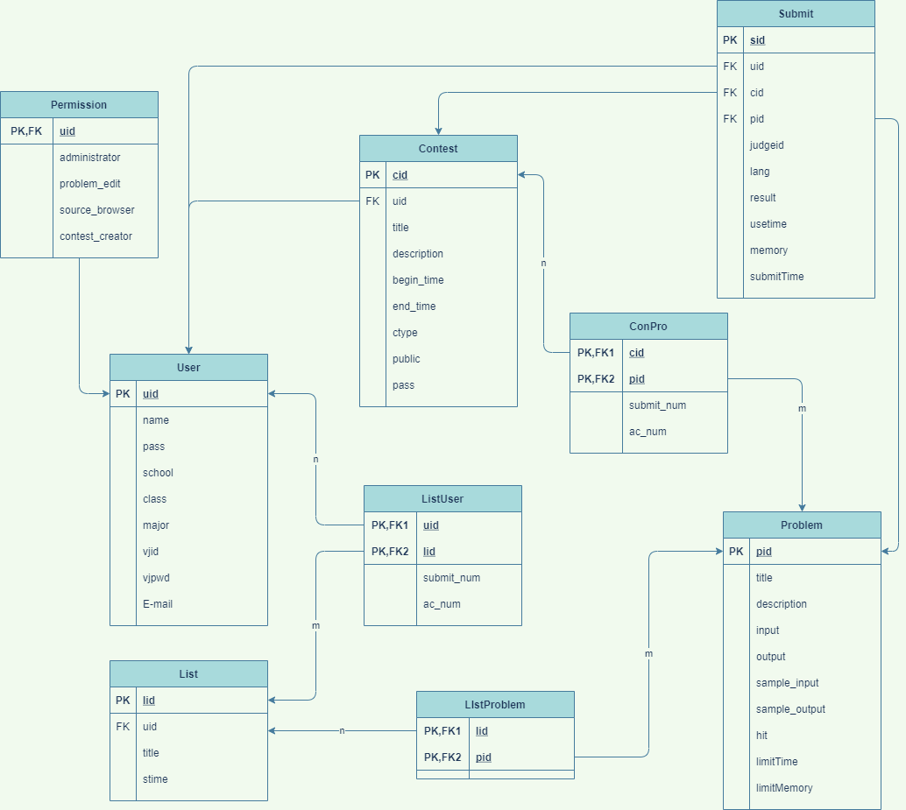

# AHUT在线判题系统

### 环境:

在安装有docker，docker-compose的本地环境\
*ps*:这是两个东西\
不会安装的看这里：[docker安装](https://blog.csdn.net/aaahuahua/article/details/122403354)

### 在本机中跑起这个项目

在ahutoj文件夹加下运行`docker-compose up -d`

如果拉取不成功，可以多拉几次或者添加docker镜像源
国内docker镜像源：

```
"registry-mirrors": [
    "https://registry.docker-cn.com",
    "https://docker.mirrors.ustc.edu.cn",
    "https://hubmirror.c.163.com",
    "http://f1361db2.m.daocloud.io"
  ]
```

### 相关依赖:

    C/C++:rabbitMQ\libamqp-dev,hiredis,libmysql

    Go:gorm、gin、air

### 项目结构图

    .
    ├── dockerfile                  构建本地docker镜像
    ├── docker-compose              构建多容器运行环境
    ├── config                      配置文件
    ├── core                        内部判题程序
    ├── docs                        各种文档资源
    ├── resource                    静态资源层
    │   ├── Data                           判题数据.in .out
    │   ├── image                          图片资源
    │   ├── spj                            特判
    ├── tmp                         docker持久化卷，容器的log，data在这里
    └── web                         后端web
        ├── cache                          缓存层
        ├── controller                     控制层
        ├── dao                            DAO数据库层
        ├── gateway                         网关层
        ├── io                             请求与相应
        ├── logic                          逻辑层
        ├── mapping                        模型映射层
        ├── middlewares                    中间件
        ├── models                         模型层
        ├── routers                        路由模块
        ├── service                        各种服务
        └── utils                          各种工具类

### 项目分层模型

    =====================
    |网关层             |
    ====================
    |服务层             |
    ====================
    |逻辑层             |
    ====================
    |模型层             |
    ====================
    |数据库层           |
    ====================

### 实现模块

#### 用户模块

> 1.用户注册模块 register\
> 2.用户登录模块 login\
> 3.用户注销模块 exit\
> 4.用户管理模块 info\
> 5.绑定Vjudge账户

#### 管理员模块

> 1.用户权限管理模块  
> 2.题目管理模块\
> 3.竞赛管理模块\
> 4.获取用户做题情况模块

#### 题目模块

> 1.题目列表模块\
> 2.题目展示模块\
> 3.用户题单模块

#### 竞赛系统模块

> 1.添加竞赛模块\
> 2.删除竞赛模块\
> 3.获取竞赛信息模块\
> 4.修改竞赛模块

#### 判题系统模块

> 1.内部判题模块 judged  (C++实现)\
> 2.第三方判题模块 originJudge(go实现)

## 三、数据库及其架构设计

数据库设计


[查看数据库代码：](./doc/oj.sql)
